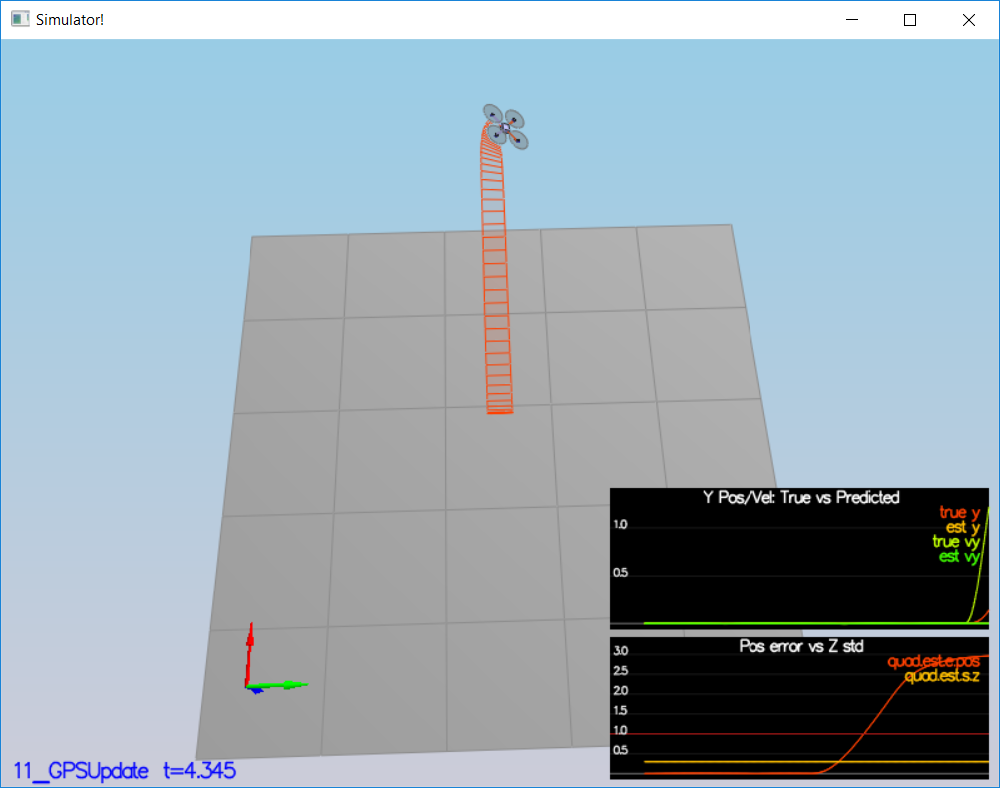
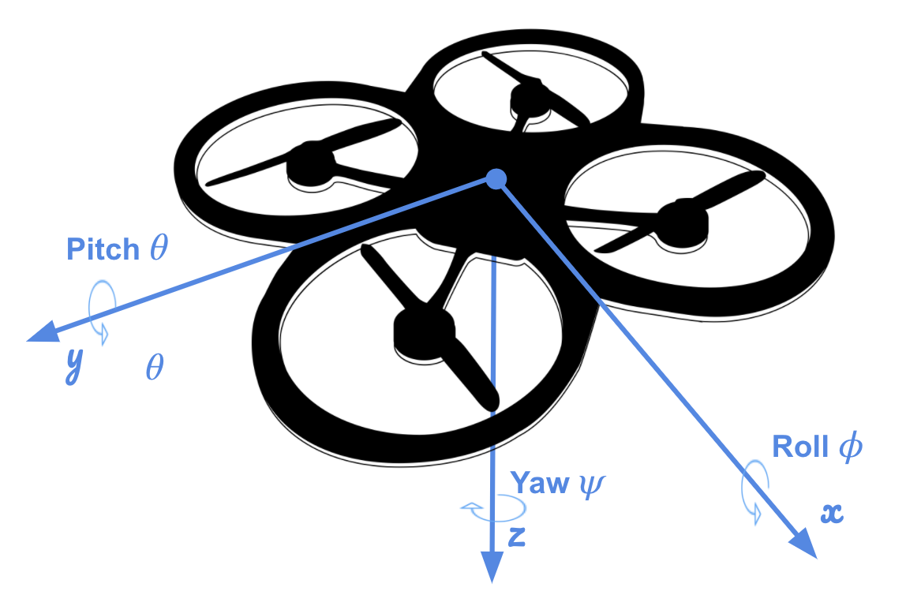
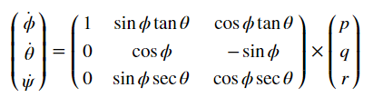
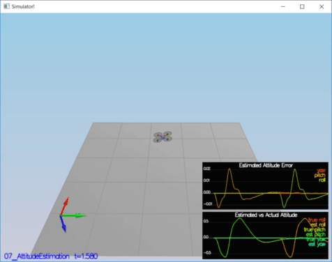
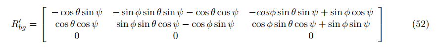
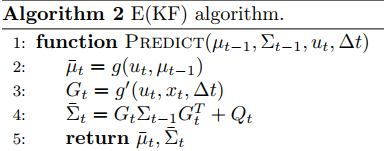
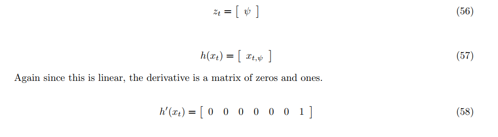

# FCND-Estimation
4th Project - Building an Estimator 





This is the last project of the Flying Car Nano Degree (FCND) - Term1. In this project, by using Extended Kalman Filter (EKF) estimation method, the estimation portion of the controller which is used in the CPP simulator is developed.By the end of the project, my simulated quad flies with my estimator and my custom controller. This project consists of 6 steps [1] .

* Step 1: Sensor Noise
* Step 2: Attitude Estimation
* Step 3: Prediction Step
* Step 4: Magnetometer Update
* Step 5: Closed Loop + GPS Update
* Step 6: Adding Your Controller

Each step is given below detailed.

## Step 1 : Sensor Noise

In this step , breifly, collecting some simulated noisy sensor data (GPS and IMU measurements) and estimate the standard deviation of those sensor. 

<p align="center">

</p>

Standard Deviation Calculation is obtaion by using [`std_cal.py`](./others/std_cal.py) code. To obation standard deviation ,  [`numpy.std`](https://docs.scipy.org/doc/numpy-1.14.0/reference/generated/numpy.std.html)[2] is used.

```
GPS X Standard Deviation (MeasuredStdDev_GPSPosXY): 0.6797007868796459
ACC X Standard Deviation (MeasuredStdDev_AccelXY): 0.475746035407147
```
**Success Criteria:**
```
* Standard deviations should accurately capture the value of approximately 68% of the respective measurements.
```
**Result:** 
```
PASS: ABS(Quad.GPS.X-Quad.Pos.X) was less than MeasuredStdDev_GPSPosXY for 68% of the time
PASS: ABS(Quad.IMU.AX-0.000000) was less than MeasuredStdDev_AccelXY for 67% of the time
```

## Step 2 : Attitude Estimation

In this setup , the complementary filter-type attitude filter is improved by integrating body rate `p,q,r` which obtained from rate gyro into the estimated pitch and roll angle.



By using this equation[3], an instantaneous change in the Euler angles (world frame) is obtained from turn rate in the body frame. 



After obtained Euler Rate, integrating into into the estimated pitch and roll angle.
```cpp
 // Predict
  float predictedPitch = pitchEst + dtIMU * euler_dot.y;
  float predictedRoll = rollEst + dtIMU * euler_dot.x;
  ekfState(6) = ekfState(6) + dtIMU * euler_dot.z;	// yaw
```
The implementation of this step is at `QuadEstimatorEKF.cpp` from line 74 to line 137. 

<p align="center">

</p>

**Performance Evaluation:**
```
* Your attitude estimator needs to get within 0.1 rad for each of the Euler angles for at least 3 seconds.
```
**Result:** 
```
PASS: ABS(Quad.Est.E.MaxEuler) was less than 0.100000 for at least 3.000000 seconds
```

## Step 3 : Prediction Step

In this senario , 

```cpp    

}
```

```cpp    

}
```

```cpp    


}
```

<p align="center">

</p>

Performance Evaluation:

* 
* 

Result: 



**Senario 4 : Magnetometer Update**

In this senario, 

<p align="center">

</p>

Performance Evaluation:

* 

Result: 


**Senario 5 : Closed Loop + GPS Update**

In this senario, 

<p align="center">

</p>

Performance Evaluation:

* 

Result: 



**Senario 6 : Adding Your Controller**

In this senario, 

<p align="center">

</p>

Performance Evaluation:

* 

Result: 




**References**
* [1] https://github.com/udacity/FCND-Estimation-CPP
* [2] https://docs.scipy.org/doc/numpy-1.14.0/reference/generated/numpy.std.html
* [3] FCND Lesson 14 - 3D Drone Exercise- Part3( [3D Controller Part](https://classroom.udacity.com/nanodegrees/nd787/parts/5aa0a956-4418-4a41-846f-cb7ea63349b3/modules/b78ec22c-5afe-444b-8719-b390bd2b2988/lessons/2263120a-a3c4-4b5a-9a96-ac3e1dbae179/concepts/8b388bf7-96dd-41b6-a11f-b134224a6ac1 )
* [x] A. P. Schoellig, C. Wiltsche and R. D’Andrea, 2012, "Feed-Forward Parameter Identification for Precise Periodic
   Quadrocopter Motions", American Control Confrence, Fairmont Queen Elizabeth, Montreal, Canada, 27-29 June 2012 
 
* [x] [FCND Lesson 12 - Section 17](https://classroom.udacity.com/nanodegrees/nd787/parts/5aa0a956-4418-4a41-846f-cb7ea63349b3/modules/b78ec22c-5afe-444b-8719-b390bd2b2988/lessons/dd98d695-14f1-40e0-adc5-e9fafe556f73/concepts/541ec6ae-f171-4195-9c05-97a5c82a85df)

