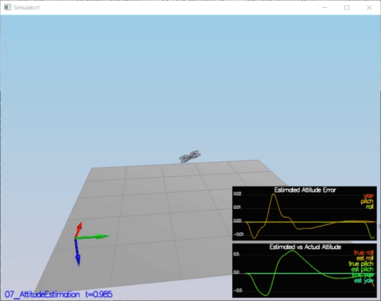
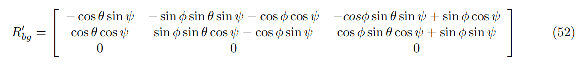

# FCND-Estimation
4th Project - Building an Estimator 

[Detailed Project Explantion Page](https://github.com/udacity/FCND-Estimation-CPP)


This is the last project of the Flying Car Nano Degree (FCND) - Term1. In this project, by using Extended Kalman Filter (EKF) estimation method, the estimation portion of the controller which is used in the CPP simulator is developed.By the end of the project, my simulated quad flies with my estimator and my custom controller. This project consists of 6 steps [1] .

* Step 1: Sensor Noise
* Step 2: Attitude Estimation
* Step 3: Prediction Step
* Step 4: Magnetometer Update
* Step 5: Closed Loop + GPS Update
* Step 6: Adding Your Controller

Each step is given below detailed.

## Step 1 : Sensor Noise

In this step , collecting some simulated noisy sensor data (GPS and IMU measurements) and estimate the standard deviation of those sensor. 

<p align="center">

</p>

Standard Deviation Calculation is obtaion by using [`std_cal.py`](./others/std_cal.py) code. To obation standard deviation ,  [`numpy.std`](https://docs.scipy.org/doc/numpy-1.14.0/reference/generated/numpy.std.html)[2] is used.

```
GPS X Standard Deviation (MeasuredStdDev_GPSPosXY): 0.6797007868796459
ACC X Standard Deviation (MeasuredStdDev_AccelXY): 0.475746035407147
```
**Success Criteria:**
```
* Standard deviations should accurately capture the value of approximately 68% of the respective measurements.
```
**Result:** 
```
PASS: ABS(Quad.GPS.X-Quad.Pos.X) was less than MeasuredStdDev_GPSPosXY for 68% of the time
PASS: ABS(Quad.IMU.AX-0.000000) was less than MeasuredStdDev_AccelXY for 67% of the time
```

## Step 2 : Attitude Estimation

In this setup , the complementary filter-type attitude filter is improved by integrating body rate `p,q,r` which obtained from rate gyro into the estimated pitch and roll angle.


By using this equation[3], an instantaneous change in the Euler angles (world frame) is obtained from turn rate in the body frame. 


After obtained Euler Rate, integrating into the estimated pitch and roll angle.
```cpp
 // Predict
  float predictedPitch = pitchEst + dtIMU * euler_dot.y;
  float predictedRoll = rollEst + dtIMU * euler_dot.x;
  ekfState(6) = ekfState(6) + dtIMU * euler_dot.z;	// yaw
```
The implementation of this step is at [`QuadEstimatorEKF.cpp`](./QuadEstimatorEKF.cpp#L74) from line 74 to line 137. 

<p align="center">

</p>

**Success Criteria:**
```
* Your attitude estimator needs to get within 0.1 rad for each of the Euler angles for at least 3 seconds.
```
**Result:** 
```
PASS: ABS(Quad.Est.E.MaxEuler) was less than 0.100000 for at least 3.000000 seconds
```

## Step 3 : Prediction Step

This step consists of two scenarios;

The first scenario , implementing the state prediction based on the acceleration measurement by using Dead Reckoning method [4]

The implementation of this step is at [`QuadEstimatorEKF.cpp`](./QuadEstimatorEKF.cpp#L162) from line 162 to line 203.

```cpp    
 //From Lesson 17 - Dead Reckoning Exercise 

  predictedState(0) = curState(0) + curState(3) * dt; // x coordianate x= x + x_dot * dt
  predictedState(1) = curState(1) + curState(4) * dt; // y coordianate y= y + y_dot * dt
  predictedState(2) = curState(2) + curState(5) * dt; // z coordianate z= z + z_dot * dt
  
  //Convert the true acceleration from body frame to the inertial frame
  V3F acc_inertial = attitude.Rotate_BtoI(accel);

  predictedState(3) = curState(3) + acc_inertial.x * dt; // change in velocity along the x is a_x * dt
  predictedState(4) = curState(4) + acc_inertial.y * dt; // change in velocity along the y is a_y * dt 
  predictedState(5) = curState(5) + acc_inertial.z * dt - CONST_GRAVITY * dt; // change in velocity along the z is a_z * dt by removing the gravity component
```

<p align="center">

</p>

The second scenario, 
The first step , calculating the partial derivative of the body-to-global rotation matrix in the function `GetRbgPrime()` by using equations `Section 7.2 ` which is given in [`Estimation for Quadrotors`](https://www.overleaf.com/read/vymfngphcccj#/54894644/) paper [5]  

 

The implementation of this step is at [`QuadEstimatorEKF.cpp`](./QuadEstimatorEKF.cpp#L205) from line 205 to line 245.

```cpp    
  // From "Estimation for Quadrotors" paper ( Eq. 52 )
  float theta = pitch;
  float phi = roll ;
  float psi = yaw ;

  RbgPrime(0,0) = (- ( cos(theta) * sin(psi) ) );
  RbgPrime(0,1) = (- ( sin(phi) * sin(theta) * sin(psi) ) - ( cos(theta) * cos(psi) ) );
  RbgPrime(0,2) = (- ( cos(phi) * sin(theta) * sin(psi) ) + ( sin(phi) * cos(psi) ) );

  RbgPrime(1,0) = ( cos(theta) * cos(psi) ) ;
  RbgPrime(1,1) = ( sin(phi) * sin(theta) * cos(psi) ) - ( cos(phi) * sin(psi) );
  RbgPrime(1,2) = ( cos(phi) * sin(theta) * cos(psi) ) + ( sin(phi) * sin(psi) );

  RbgPrime(2,0) = 0;
  RbgPrime(2,1) = 0;
  RbgPrime(2,2) = 0;
```
The second step, obtaining `Jacobian Matrix`  by using `GetRbgPrime()` and after iplementing prediction step (predict the state covariance forward) to  update the covariance matrix cov according to the EKF equation. For `Jacobian Matrix` equations in `Section 7.2` and prediction equations in `Section 3 ` which are given in [`Estimation for Quadrotors`](https://www.overleaf.com/read/vymfngphcccj#/54894644/) paper [5]  


 


 

The implementation of this step is at [`QuadEstimatorEKF.cpp`](./QuadEstimatorEKF.cpp#L247) from line 247 to line 300.

```cpp    
  // From "Estimation for Quadrotors" paper ( Eq. 51 )
  gPrime(0,3) = dt;
  gPrime(1,4) = dt;
  gPrime(2,5) = dt;
  
  gPrime(3, 6) = (RbgPrime(0) * accel).sum() * dt;
  gPrime(4, 6) = (RbgPrime(1) * accel).sum() * dt;
  gPrime(5, 6) = (RbgPrime(2) * accel).sum() * dt;
  
  // From "Estimation for Quadrotors" paper ( Section 3 ) 
  ekfCov = gPrime * ekfCov * gPrime.transpose() + Q;
```
<p align="center">

</p>

**Success Criteria:**
```
* This step doesn't have any specific measurable criteria being checked.
```

## Step 4 : Magnetometer Update

In this step, the information from the magnetometer is added to improve filter's performance in estimating the vehicle's heading.

 [5]

The implementation of this step is at [`QuadEstimatorEKF.cpp`](./QuadEstimatorEKF.cpp#L340) from line 340 to line 371.

```cpp 
  hPrime(0, 6) = 1; // hPrime= [ 0 0 0 0 0 1]

  zFromX(0) = ekfState(6);

  //normalize the difference between your measured and estimated yaw
  float diff = magYaw - zFromX(0);
  if ( diff > F_PI ) {
    zFromX(0) += 2.f*F_PI;
  } else if ( diff < -F_PI ) {
    zFromX(0) -= 2.f*F_PI;
  }
```
<p align="center">

</p>

**Performance Evaluation:**
```
* Your goal is to both have an estimated standard deviation that accurately captures the error and maintain an error of less than 0.1rad in heading for at least 10 seconds of the simulation.
```
**Result:** 
```
PASS: ABS(Quad.Est.E.Yaw) was less than 0.120000 for at least 10.000000 seconds
PASS: ABS(Quad.Est.E.Yaw-0.000000) was less than Quad.Est.S.Yaw for 57% of the time
```

## Senario 5 : Closed Loop + GPS Update

In this step,  GPS update is implemented into estimator. by the help of the equations `Section 7.3.1 ` from [`Estimation for Quadrotors`](https://www.overleaf.com/read/vymfngphcccj#/54894644/) paper [5] , implementation is achieved.


The implementation of this step is at [`QuadEstimatorEKF.cpp`](./QuadEstimatorEKF.cpp#L302) from line 302 to line 338.

```cpp    
  // From "Estimation for Quadrotors" paper ( Eq. 53 & Eq. 54 )
  zFromX(0) = ekfState(0);
  zFromX(1) = ekfState(1);
  zFromX(2) = ekfState(2);
  zFromX(3) = ekfState(3);
  zFromX(4) = ekfState(4);
  zFromX(5) = ekfState(5);

  // From "Estimation for Quadrotors" paper ( Eq. 55 )
  hPrime(0, 0) = 1;
  hPrime(1, 1) = 1;
  hPrime(2, 2) = 1;
  hPrime(3, 3) = 1;
  hPrime(4, 4) = 1;
  hPrime(5, 5) = 1;
```
<p align="center">

</p>

**Success Criteria:**
```
* Your objective is to complete the entire simulation cycle with estimated position error of < 1m.
```
**Result:** 
```
PASS: ABS(Quad.Est.E.Pos) was less than 1.000000 for at least 20.000000 seconds
```

## Senario 6 : Adding Your Controller

In this step, my controller which was designed in Project 3 ([`FCND-Controls`](https://github.com/mehmetyldz87/FCND-Controls) ) performs and de-tune my controller accordingly.

<p align="center">

</p>

**Success Criteria:**
```
*  Your objective is to complete the entire simulation cycle with estimated position error of < 1m.
```
**Result:** 
```
PASS: ABS(Quad.Est.E.Pos) was less than 1.000000 for at least 20.000000 seconds
```

**References**
* [1] https://github.com/udacity/FCND-Estimation-CPP
* [2] https://docs.scipy.org/doc/numpy-1.14.0/reference/generated/numpy.std.html
* [3] [FCND Lesson 14 - 3D Drone Exercise- Part3](https://classroom.udacity.com/nanodegrees/nd787/parts/5aa0a956-4418-4a41-846f-cb7ea63349b3/modules/b78ec22c-5afe-444b-8719-b390bd2b2988/lessons/2263120a-a3c4-4b5a-9a96-ac3e1dbae179/concepts/8b388bf7-96dd-41b6-a11f-b134224a6ac1 )
* [4] [FCND Lesson 17 - Dead Reckoning 3D Exercise](https://classroom.udacity.com/nanodegrees/nd787/parts/5aa0a956-4418-4a41-846f-cb7ea63349b3/modules/19b5af05-2ec7-491a-94db-1befc15d07c0/lessons/4d183789-b12c-462f-a134-9503d9216373/concepts/1a584896-3f75-4a52-88a9-6ae35e99d0c0# )
* [5] S. Tellex, A. Brown and S. Lupashin, 2018, ["Estimation for Quadrotors"](https://www.overleaf.com/read/vymfngphcccj#/54894644/)
