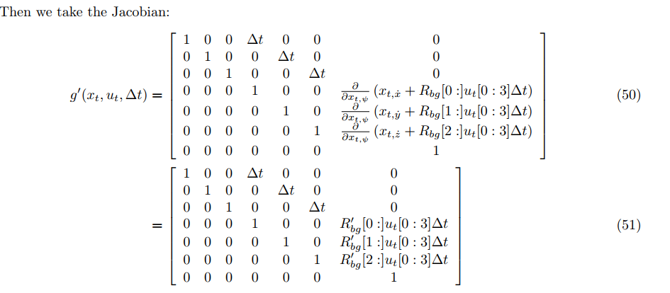

# FCND-Estimation
4th Project - Building an Estimator 


This is the last project of the Flying Car Nano Degree (FCND) - Term1. In this project, by using Extended Kalman Filter (EKF) estimation method, the estimation portion of the controller which is used in the CPP simulator is developed.By the end of the project, my simulated quad flies with my estimator and my custom controller. This project consists of 6 steps.

* Step 1: Sensor Noise
* Step 2: Attitude Estimation
* Step 3: Prediction Step
* Step 4: Magnetometer Update
* Step 5: Closed Loop + GPS Update
* Step 6: Adding Your Controller [1]

Each step is given below detailed.

## Step 1 : Sensor Noise

In this step , breifly, collecting some simulated noisy sensor data (GPS and IMU measurements) and estimate the standard deviation of those sensor

<p align="center">

</p>

Standard Deviation Calculation is obtaion by using [`std_cal.py`](./others/std_cal.py) code. To obation standard deviation ,  [`numpy.std`](https://docs.scipy.org/doc/numpy-1.14.0/reference/generated/numpy.std.html)[2] is used.

**Success criteria:

* Standard deviations should accurately capture the value of approximately 68% of the respective measurements.

**Result: 


**Senario 2 : Attitude Estimation**

In this senario , 


```cpp    

}
```

```cpp    

}
```

```cpp    

}
```


<p align="center">

</p>

Performance Evaluation:

* 
* 

Result: 


**Senario 3 : Prediction Step**

In this senario , 

```cpp    

}
```

```cpp    

}
```

```cpp    


}
```

<p align="center">

</p>

Performance Evaluation:

* 
* 

Result: 


**Senario 4 : Magnetometer Update**

In this senario, 

<p align="center">

</p>

Performance Evaluation:

* 

Result: 



**Senario 5 : Closed Loop + GPS Update**

In this senario, 

<p align="center">

</p>

Performance Evaluation:

* 

Result: 


**Senario 6 : Adding Your Controller**

In this senario, 

<p align="center">

</p>

Performance Evaluation:

* 

Result: 


**References**
* [1] https://github.com/udacity/FCND-Controls
* [2] https://docs.scipy.org/doc/numpy-1.14.0/reference/generated/numpy.std.html
* [x] A. P. Schoellig, C. Wiltsche and R. D’Andrea, 2012, "Feed-Forward Parameter Identification for Precise Periodic
   Quadrocopter Motions", American Control Confrence, Fairmont Queen Elizabeth, Montreal, Canada, 27-29 June 2012 
* [x] FCND Lesson 4 - 3D Drone-Full-Notebook ( [3D Controller Part](https://classroom.udacity.com/nanodegrees/nd787/parts/5aa0a956-4418-4a41-846f-cb7ea63349b3/modules/b78ec22c-5afe-444b-8719-b390bd2b2988/lessons/2263120a-a3c4-4b5a-9a96-ac3e1dbae179/concepts/47b0380b-3d5a-426b-8409-45f947c8f343#) ) 
* [x] [FCND Lesson 12 - Section 17](https://classroom.udacity.com/nanodegrees/nd787/parts/5aa0a956-4418-4a41-846f-cb7ea63349b3/modules/b78ec22c-5afe-444b-8719-b390bd2b2988/lessons/dd98d695-14f1-40e0-adc5-e9fafe556f73/concepts/541ec6ae-f171-4195-9c05-97a5c82a85df)

